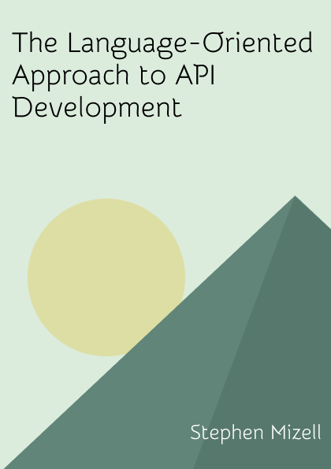

# The Language-Oriented Approach to API Development

*by [Stephen Mizell](https://smizell.com)*

*The Language-Oriented Approach to API Development* is a book about a different way to think about the API development lifecycle. In this approach, people create their own language for the way they talk about APIs and capture that language in a DSL. From there, they generate OpenAPI documents that always match the style and standards of the organization or team. This stands in contrast to the common approach of using linters to restrict or limit how people design APIs with OpenAPI. Instead of learning how an organization' or team's approach to APIs fits within OpenAPI, people can focus on the DSL.

## Copyright and license

All content here is copyright to Stephen Mizell. This work is licensed under a <a rel="license" href="http://creativecommons.org/licenses/by-sa/4.0/">Creative Commons Attribution-ShareAlike 4.0 International License</a>.

